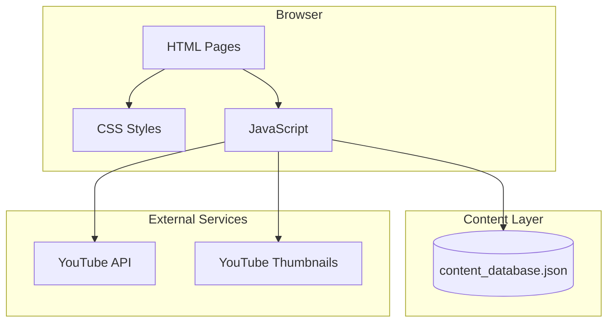
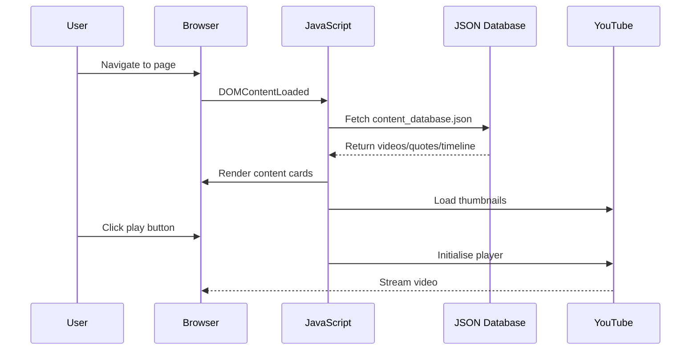

# Steve Jobs Archive

A curated archive dedicated to the life, work, and wisdom of Steve Jobs. This static website features interviews, speeches, keynotes, product launches, and timeless quotes spanning three decades of innovation.

## Overview

This project consolidates content from multiple sources into a single, beautifully designed archive featuring an Apple-inspired dark theme. The website is built with modern web technologies and requires no backend - simply open `index.html` in a browser or deploy to any static hosting service.

### Key Features

- **40+ Videos**: Interviews, keynotes, product launches, and rare footage (1980-2011)
- **20+ Quotes**: Curated wisdom on life, creativity, and innovation
- **Interactive Timeline**: Key moments from Steve Jobs' remarkable life
- **Category Filtering**: Browse by Interviews, Speeches, Product Launches, Keynotes, and more
- **Responsive Design**: Optimised for desktop, tablet, and mobile
- **YouTube Integration**: Embedded video playback with fallback support

## Architecture



### Data Flow



## Technology Stack

| Category  | Technology                              |
| --------- | --------------------------------------- |
| Markup    | HTML5 (Semantic)                        |
| Styling   | CSS3 (Custom Properties, Flexbox, Grid) |
| Scripting | Vanilla JavaScript (ES6+)               |
| Fonts     | SF Pro (Apple System Font Stack)        |
| Video     | YouTube IFrame API                      |
| Icons     | SVG Emoji Favicon                       |

## Getting Started

### Prerequisites

- Modern web browser (Chrome, Firefox, Safari, Edge)
- Local web server (optional, for development)

### Quick Start

1. **Clone or download the repository**

   ```bash
   git clone https://github.com/username/steve-jobs-archive.git
   cd steve-jobs-archive
   ```

2. **Open directly in browser**

   ```bash
   open src/index.html
   ```

   Or use a local server for development:

   ```bash
   # Using Python
   cd src && python3 -m http.server 8000

   # Using Node.js
   npx serve src

   # Using PHP
   php -S localhost:8000 -t src
   ```

3. **View the website**
   Navigate to `http://localhost:8000` in your browser.

## Project Structure

```
steve-jobs-archive/
├── src/
│   ├── css/
│   │   └── styles.css           # Apple-inspired dark theme
│   ├── js/
│   │   ├── main.js              # Core functionality & YouTube API
│   │   ├── browse.js            # Filter/sort for browse page
│   │   └── quotes.js            # Quotes page functionality
│   ├── data/
│   │   └── content_database.json # Videos, quotes, timeline data
│   ├── assets/
│   │   └── images/              # (Optional) Local images
│   ├── index.html               # Home page
│   ├── browse.html              # Browse archive page
│   └── quotes.html              # Quotes collection page
├── docs/
│   └── architecture/            # Technical documentation
├── .gitignore
└── README.md
```

## Development

### Adding New Content

Edit `src/data/content_database.json` to add videos or quotes:

```json
{
  "videos": [
    {
      "id": "unique-id",
      "title": "Video Title",
      "youtube_id": "YOUTUBE_VIDEO_ID",
      "category": "Interviews",
      "description": "Brief description",
      "year": 2007,
      "featured": false
    }
  ],
  "quotes": [
    {
      "id": "quote-id",
      "quote": "The quote text here",
      "source": "Source/Attribution",
      "year": 2005,
      "featured": false
    }
  ]
}
```

### Categories

Available video categories:

- Interviews
- Speeches
- Product Launches
- Keynotes
- Early Career
- Rare Footage
- Business Philosophy
- Design
- Pixar
- Documentaries
- Q&A Sessions
- Marketing
- Entrepreneurship

### Customising Styles

CSS custom properties are defined in `src/css/styles.css`:

```css
:root {
  --color-background: #000000;
  --color-surface: #1d1d1f;
  --color-accent: #0071e3;
  --color-text-primary: #f5f5f7;
  --color-text-secondary: #a1a1a6;
}
```

## Deployment

### Static Hosting

Deploy to any static hosting provider:

**Vercel**

```bash
vercel --prod
```

**Netlify**

```bash
netlify deploy --prod --dir=src
```

**GitHub Pages**

1. Push to GitHub
2. Settings > Pages > Source: main branch, /src folder

**AWS S3**

```bash
aws s3 sync src/ s3://your-bucket-name --acl public-read
```

### Performance Optimisation

For production, consider:

- Minifying CSS/JS files
- Compressing images
- Enabling gzip compression on server
- Adding a CDN for global distribution

## Browser Support

| Browser | Version |
| ------- | ------- |
| Chrome  | 80+     |
| Firefox | 75+     |
| Safari  | 13+     |
| Edge    | 80+     |

## Content Sources

All video content is sourced from publicly available archives:

- YouTube (interviews, keynotes, speeches)
- Archive.org (historical footage)

Quotes are sourced from:

- Stanford Commencement Speech (2005)
- WWDC presentations
- Published interviews and biographies

## Legal Notice

This is a fan-made archive for educational purposes. Not affiliated with Apple Inc. All trademarks belong to their respective owners. Video content remains the property of original creators and is embedded via YouTube's official embed API.

## Contributing

1. Fork the repository
2. Create a feature branch (`git checkout -b feature/new-content`)
3. Commit changes (`git commit -m 'Add new interview'`)
4. Push to branch (`git push origin feature/new-content`)
5. Open a Pull Request

## Licence

MIT Licence - See [LICENCE](./LICENCE) for details.

---

_"The people who are crazy enough to think they can change the world are the ones who do."_
