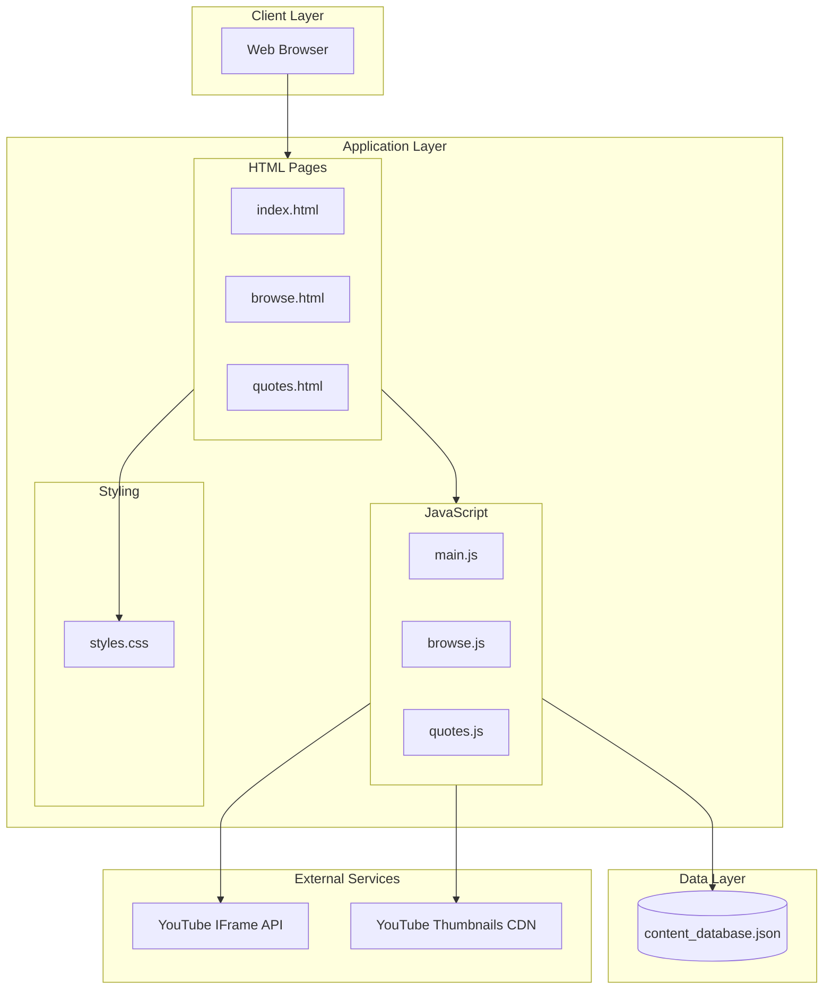
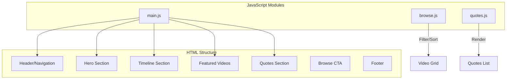
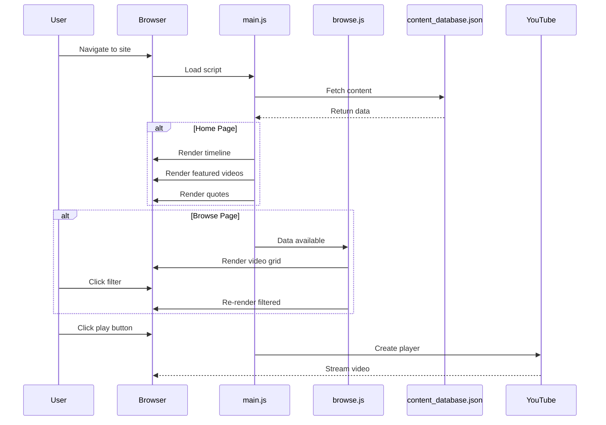

# System Architecture

## Overview

The Steve Jobs Archive is a static website built with HTML, CSS, and JavaScript. It requires no backend server and can be deployed to any static hosting service.

## Architecture Diagram



## Component Structure



## Data Flow



## File Structure

```
src/
├── index.html          # Home page
├── browse.html         # Browse archive page
├── quotes.html         # Quotes collection
├── css/
│   └── styles.css      # All styling (750+ lines)
├── js/
│   ├── main.js         # Core functionality (200+ lines)
│   ├── browse.js       # Browse page logic (100+ lines)
│   └── quotes.js       # Quotes page logic (80+ lines)
├── data/
│   └── content_database.json  # All content (40+ videos, 20+ quotes)
└── assets/
    └── images/         # Optional local images
```

## Key Features

### 1. Content Database

Single JSON file containing:

- 40+ video entries with YouTube IDs
- 20+ curated quotes with sources
- 12 timeline events
- Category definitions

### 2. Filter System

- Category-based filtering (Interviews, Speeches, etc.)
- Sort options (date, title)
- Real-time count updates

### 3. YouTube Integration

- YouTube IFrame API for embedded playback
- Fallback to direct iframe if API fails
- Lazy loading of thumbnails

### 4. Responsive Design

- Mobile-first approach
- CSS Grid and Flexbox layouts
- Breakpoints: 480px, 768px, 1024px

### 5. Animations

- Intersection Observer for scroll animations
- Staggered card animations
- Smooth transitions

## Performance Considerations

| Aspect    | Implementation                              |
| --------- | ------------------------------------------- |
| Loading   | Lazy load images, defer non-critical JS     |
| Rendering | CSS transitions, GPU-accelerated animations |
| Data      | Single JSON fetch, cached in memory         |
| Images    | YouTube CDN thumbnails, SVG fallbacks       |
| Fonts     | System font stack (no external fonts)       |

## Security

- No user input processing
- No authentication required
- No sensitive data storage
- Content from public sources only
- YouTube embed API (sandboxed iframes)
